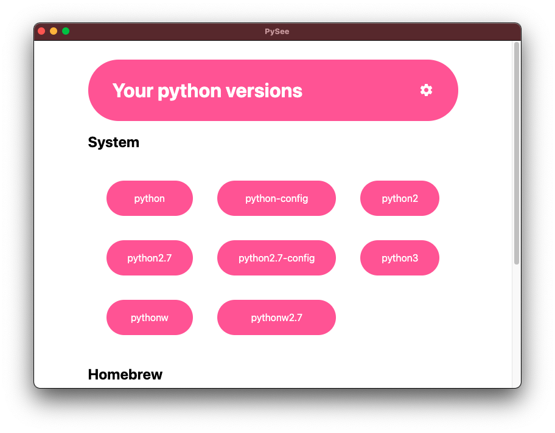
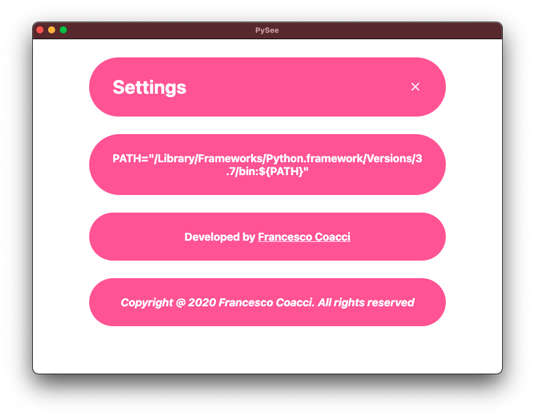

# PySee
### **PySee** is an electron-built python version manager.

## How it works?
### This desktop application (for the moment) is MacOS only. To find all the python related stuff it execute some shell commands and parse data to display on the app.

## Getting Started
### To setup and start the application:
```bash
$ cd PySee-master
$ npm install
$ npm start
```

## Content
### As you can see you can also see the PATH grabbed from your .bash_profile.



## Coming Soon...
### PySee will automatically check for other python versions downloaded with Anaconda and so on. The goal for this Electron app is also to uninstall python versions (pip packages too?) directly from the app using UI.
### PySee will also automatically detect python versions conflict.
